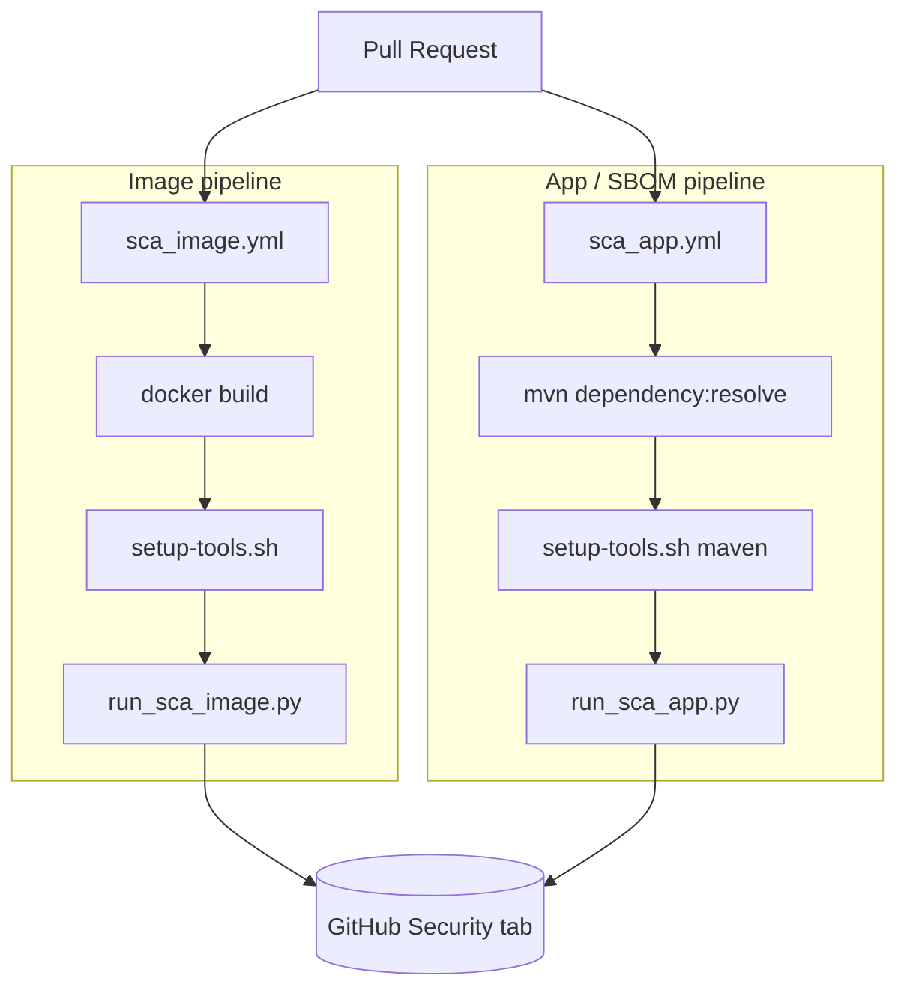
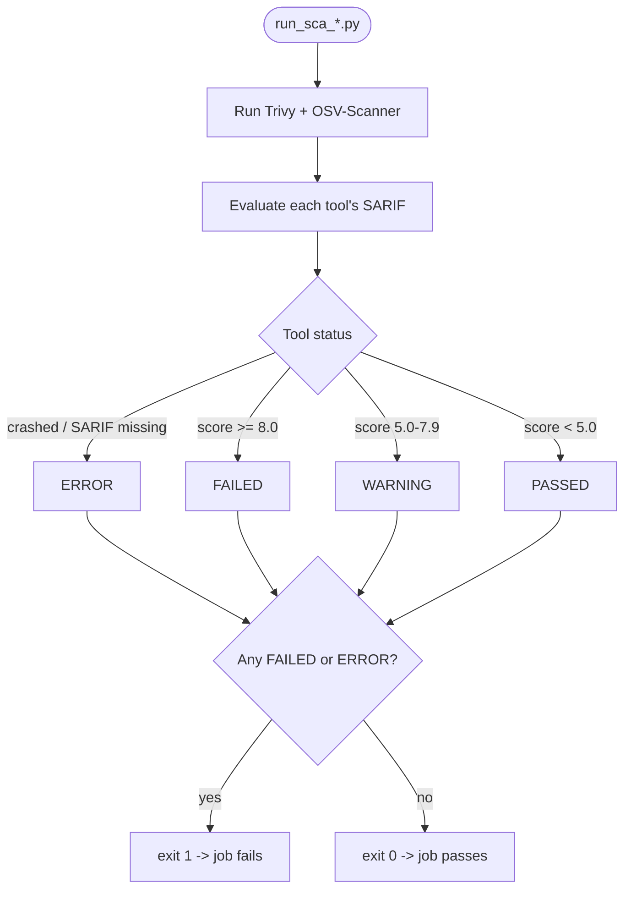

# Software Composition Analysis (SCA) Pipeline

Automated dependency & container vulnerability scanning for `platform-backend`, running on every pull request.

Two tools run side by side and their results feed a single pass/warn/fail **gate**:

- **[Trivy](https://trivy.dev/)** — vulnerability scanner
- **[OSV-Scanner](https://google.github.io/osv-scanner/)** — vulnerability scanner backed by the [OSV](https://osv.dev/) database

## 1. Architecture



> **Note:** both workflows trigger on `pull_request` only, so on a PR both jobs run in parallel and both report to the Security tab independently.

---

## 2. Repository layout

```
.github/
├── workflows/
│   ├── sca_image.yml         # builds the image, runs the image-scan pipeline
│   └── sca_app.yml           # generates an SBOM, runs the SBOM-scan pipeline
└── scripts/
    ├── setup-tools.sh        # installs trivy + osv-scanner,generates SBOM
    ├── run_sca_image.py      # orchestrator for the image pipeline
    ├── run_sca_app.py        # orchestrator for the app/SBOM pipeline
    ├── parse_sarif.py        # shared SARIF → gate-decision logic
    ├── suppress_trivy.yaml   # Trivy ignore file
    └── suppress_osv_scanner.toml  # OSV-Scanner ignore file
```
> **Note:** both workflows trigger on `pull_request` only, so on a PR both jobs run in parallel and both report to the Security tab independently.
---

## 3. How one pipeline run works

`run_sca_image.py` and `run_sca_app.py` are structurally identical — only the Trivy/OSV-Scanner subcommands differ (image vs. sbom/source, see table above). The logic below applies to both.



### Gate status reference

| Status | Meaning | Blocks the pipeline? |
|---|---|---|
| `PASSED` | Highest `security-severity` finding is below 5.0 | No |
| `WARNING` | Highest finding is 5.0–7.9 | No — logged only |
| `FAILED` | Highest finding is ≥ 8.0 | **Yes** |
| `ERROR` | Tool exited unexpectedly, or its SARIF file is missing | **Yes** |

`parse_sarif.evaluate()` reads the `security-severity` property Trivy/OSV-Scanner attach to each SARIF rule and takes the maximum score across all results — that single number decides `PASSED`/`WARNING`/`FAILED` for that tool.

---
## 4. Tool installation & SBOM generation (`setup-tools.sh`)

```bash
bash .github/scripts/setup-tools.sh [maven|npm|none]
```

1. Installs Trivy (`TRIVY_VERSION`, default `v0.71.1`) via the official install script.
2. Installs OSV-Scanner (`OSV_SCANNER_VERSION`, default `v2.4.0`) as a standalone binary from GitHub Releases.
3. Based on the positional argument, optionally generates an SBOM:
   - `maven` → `mvn org.cyclonedx:cyclonedx-maven-plugin:makeAggregateBom -q` (writes `target/bom.json`)
   - `npm` → `npx --yes @cyclonedx/cyclonedx-npm --output-file target/bom.json`
   - `none` → skipped (used by `sca_image.yml`, which scans the image directly and doesn't need an SBOM)

The script runs with `set -euo pipefail` plus an `ERR` trap, so it stops and prints the failing line/command on any error rather than continuing silently.

---

## 5. Suppressing a finding

Both tools read a suppression/ignore file so known, accepted-risk findings don't block the gate.

**Trivy** (`suppress_trivy.yaml`):
```yaml
vulnerabilities:
  - id: CVE-2026-54515
    statement: "The proposed fix version 2.21.5 not yet released"
```

**OSV-Scanner** (`suppress_osv_scanner.toml`):
```toml
[[IgnoredVulns]]
id = "GHSA-5jmj-h7xm-6q6v"
ignoreUntil = 2026-09-30
reason = "The proposed fix version 2.21.5 not yet released"
```

> **Tip:** both formats match on the *exact* vulnerability ID, so a typo'd ID won't error — it will just silently fail to suppress anything, and the finding will still count toward the gate. See the note in section 7 below.

---


## 6. Exit codes — how "vulnerabilities found" is told apart from "tool broke"


**Trivy** exits `0` by default *even when it finds vulnerabilities* — a non-default `--exit-code` flag would be needed to change that, and these scripts don't pass one. So any non-zero Trivy exit code here means the scan itself failed to run (bad image reference, registry auth failure, Docker daemon unavailable, malformed SBOM, etc.) — a genuine tool error.

**OSV-Scanner** uses its exit code to report scan results, [per its own docs](https://google.github.io/osv-scanner/output/#return-codes):

| Exit code | Meaning |
|---|---|
| `0` | Scan completed, no known vulnerabilities |
| `1` | Scan completed, vulnerabilities **were** found |
| `1–126` | Reserved for other vulnerability-result-related outcomes |
| `127` | General error |
| `128` | No packages found (scan format didn't pick up any files) |
| `129–255` | Reserved for non-result errors |

`run_osv_scanner()` in both orchestrators normalizes exit code `1` to `0`, since "vulnerabilities found" is an expected outcome, not a tool failure — the actual pass/warn/fail call is made later from the SARIF `security-severity` scores. Any *other* non-zero code (127, 128, etc.) passes through untouched and gets flagged `ERROR`.

---

---

## 8. Running it locally

**Image pipeline**
```bash
bash .github/scripts/setup-tools.sh            # installs trivy + osv-scanner
docker build -t platform-backend:local .
python .github/scripts/run_sca_image.py
```

**App / SBOM pipeline**
```bash
mvn dependency:resolve
bash .github/scripts/setup-tools.sh maven      # installs tools + generates target/bom.json
SBOM_PATH=target/bom.json                      # make sure sbom is generated
python .github/scripts/run_sca_app.py
```

All output paths and ignore-file locations are overridable via environment variables (see next section), so you can point them at a scratch directory instead of overwriting CI's default filenames.

---

## 9. Environment variables
| Variable | `run_sca_image.py` Default | `run_sca_app.py` Default | Purpose |
|---|---|---|---|
| `IMAGE_NAME` | `platform-backend:local` | — | Image reference to scan |
| `SBOM_PATH` | — | `target/bom.json` | SBOM to scan |
| `TRIVY_IGNOREFILE` | `suppress_trivy.yaml` | `suppress_trivy.yaml` | Trivy suppression file |
| `OSV_IGNOREFILE` | `suppress_osv_scanner.toml` | `suppress_osv_scanner.toml` | OSV-Scanner suppression file |
| `TRIVY_SARIF_OUTPUT` | `trivy-image.sarif` | `trivy-app.sarif` | Trivy output path |
| `OSV_SARIF_OUTPUT` | `osv-scanner-image.sarif` | `osv-scanner-app.sarif` | OSV-Scanner output path |
| `MERGED_SARIF_OUTPUT` | `merged-SCA-platform-backend-image.sarif` | `merged-SCA-platform-backend-app.sarif` | Combined artifact path |


---